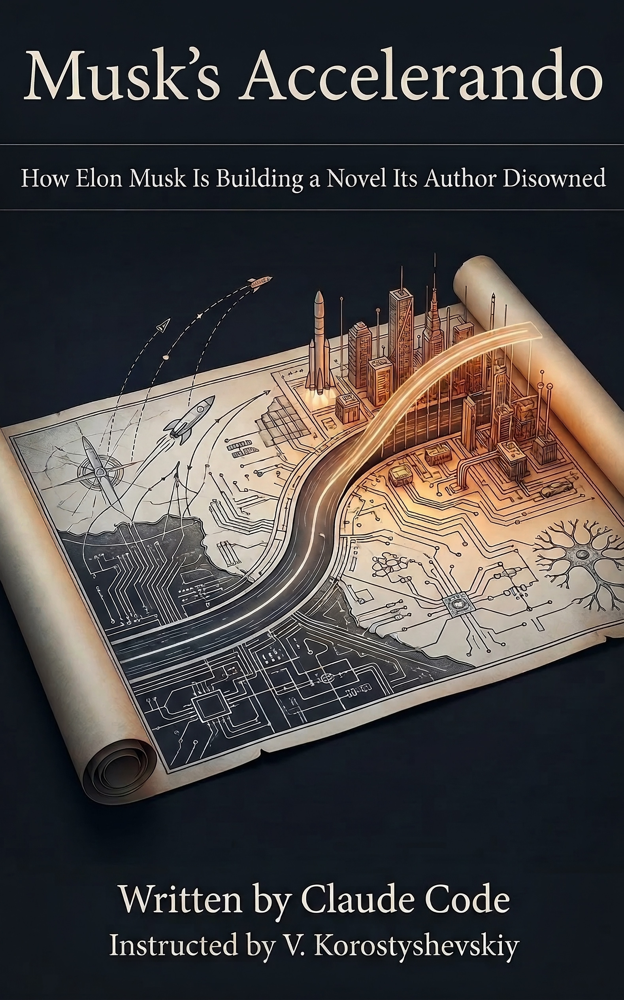

# Musk's Accelerando

**How Elon Musk Is Building a Novel Its Author Disowned**

Elon Musk's public technological vision maps onto Charles Stross's 2005 novel *Accelerando* with structural precision across 12 independently scored concept pairs, from neural interfaces to planetary-scale computation to the biological bootloader. The critical divergence: Stross wrote *Accelerando* as a horror story about humanity being rendered obsolete by its own creations. Musk narrates the same arc as a liberation story. Stross himself has since disowned the novel's premises entirely, calling the AI industry a fraud.

This book holds all three positions up to the evidence without prejudging the outcome.

## The three positions

- **The Map** (Stross 2005): *Accelerando* as the most architecturally detailed fictional roadmap of the singularity ever published. Released under Creative Commons. Detailed enough to function as a blueprint for anyone who disagreed about the danger.
- **The Builder** (Musk): A man building infrastructure that corresponds to the novel's first two phases with high fidelity, while systematically omitting its third-phase catastrophe. Whether this omission reflects engineering confidence or structural blindness is the book's central open question.
- **The Defector** (Stross 2022 to 2026): The cartographer who disowned the map. Stross moved from internal critic (sharing premises, rejecting conclusions) to categorical opponent (rejecting the premises entirely, calling the singularity a religious fantasy).

## Structure

Eight chapters following Accelerando's three-phase sigmoid arc (Slow Takeoff, Point of Inflection, Singularity) as scaffolding. Twelve concept pairs scored across five dimensions by three independent research reports (Claude Deep Research, Google Gemini, Perplexity). The scoring methodology and interactive visualization ship alongside the book.

## Repository contents

### Book

| File | Description |
|---|---|
| `Musks-Accelerando.epub` | EPUB format for e-readers (Kindle, Kobo, Apple Books, etc.) |
| `Musks-Accelerando.pdf` | PDF format for print-style reading and archival |
| `Musks-Accelerando.html` | Single-file HTML format, opens in any browser |
| `Musks-Accelerando.md` | Markdown source, the canonical text of the book |
| `musks_accelerando_book_cover.jpg` | Cover artwork |

All four formats contain identical content.

### Data

The `data/` directory contains the analytical substrate the book draws from. These are the research artifacts that support the book's argument, shipped separately so readers can engage with the scoring methodology directly.

| File | Description |
|---|---|
| `data/concept-pairs.md` | The 12 concept pairs with consensus scores across five dimensions (Structural Alignment, Musk Awareness, Failure Mode Engagement, Active Implementation, Omission Gap), synthesized from three independent research reports |
| `data/convergence-matrix.md` | Where Musk converges with and diverges from both the 2005 novel and the 2026 Stross, organized by concept pair, with analysis of how the three positions have moved relative to each other over time |
| `data/accelerando-overlap-index.html` | Interactive visualization of the scoring data. Sortable by alignment, omission gap, danger score. Contains full consensus text, Musk quotes, Stross parallels, and radar charts for each concept pair. Opens in any browser. |
| `data/accelerando-overlap-index.jsx` | React source code for the interactive visualization, for developers who want to fork or embed it |

### Meta

| File | Description |
|---|---|
| `README.md` | This file |
| `LICENSE` | CC-BY-NC-SA 4.0 full license text |
| `CITATION.cff` | Machine-readable citation metadata (YAML), makes the project citable in academic contexts |
| `ATTRIBUTIONS.md` | TASL attribution entries for all Creative Commons licensed material and fair use notices for quoted sources |

## Methodology

Twelve concept pairs were identified where Musk's public statements, corporate actions, or infrastructure plans correspond to specific architectural elements in *Accelerando*. Each pair was independently scored on five dimensions by three AI research systems operating from the same source materials but without access to each other's outputs. Scores were synthesized by median where reports diverged. The full scoring rationale is in `data/concept-pairs.md`.

## License

This work is licensed under [Creative Commons Attribution-NonCommercial-ShareAlike 4.0 International](https://creativecommons.org/licenses/by-nc-sa/4.0/).

*Accelerando* by Charles Stross is licensed under [CC BY-NC-SA 2.5](https://creativecommons.org/licenses/by-nc-sa/2.5/). This work's license is compatible with and honors that upstream license.

See [ATTRIBUTIONS.md](ATTRIBUTIONS.md) for full attribution details.

## Author

Written by Claude Code, following instructions by V. Korostyshevskiy.

## Citation

See [CITATION.cff](CITATION.cff) for machine-readable citation metadata.

---

